# Mini-asistente Personal

## 🔋 Stack Utilizado

Lenguaje de programación: Python 3.14
BD: SQLite
Lib. gráfica: Tkinter
Lib. para análisis y gráficos: NumPy, Pandas y Matplotlib

## 👉 Descripción

Aplicación para gestionar tareas, eventos y notas rápidas del usuario.
La información se almacena en una B.D. (local), se gestiona a traves de una interfaz gráfica (tkinder), contiene las  funciones de gestión tipicas de un CRUD; e incluye la generación de gráficos estadísticos para mostrar los datos cuantificables registrados.

---

## 👀 Requisitos

- Python 3.10 o superior
- Librerías:
  - `tkinter` (desarrollo de interfaz gráfica)
  - `sqlite3` (desarrollo de interfaz gráfica)
  - `json` (para manipular archivos JSON)
  - `fpdf` (para generar PDF)
  - `numpy` (libreria Py especializada en cálculo numérico)
  - `pandas` (libreria Py para análisis y manipulación de datos)
  - `matplotlib` (libreria Py para generación de gráficos estadísticos)

Instalación de librerias adcionales requeridas:

```bash
pip install fpdf numpy pandas matplotlib
```

SQLite, tkinter y json viene integrado en Python, no requiere instalación adicional.

---

## 🚀 Uso

1. Ejecutar el archivo principal:

```bash
python main.py
```

2. La ventana principal muestra las 3 actividades que gestiona la app: 'Tareas', 'Eventos' y 'Notas'.
   * Cada actividad tiene su Frame.
   * Al lado derecho; los botones para registrar nueva actividad o eliminarla. Ademas, en la actividad 'Tareas' hay botón para cambiar el estado de la misma: 'Pendiente', 'En progreso', 'Completada', 'Archivada'.
   * Además, cada actividad tiene la posibilidad para etiquetar 'tags' para poder clasifcarlas.
   * La edición (modificación) de cada actividad se logra haciendo doble-click sobre la misma.
   * Para eliminar, primero de se debe hacer click sobre la actividad (es decir, seleccionarla) para luego darle al botón de eliminar.
   * En la barra de menú, tenemos estas opciones para el usuario:
   - Exportar toda la data a JSON
   - Generar un PDF con listado de la data registrada
   - Ver cuadros estadísticos respecto a la data
   * Las opciones administrativas (usuario Administrador'):
   - Borrar toda la data de la BD
   - Cambiar la clave del 'Adminstrador' (por defecto 'abc123')


3. Descripción de las actividades:

**Tareas**
* Descripción
* Fechas -> Fecha 'dd/mm/aaaa'. Fecha asignada para cumplir la 'tarea'.
* Prioridad -> 'Alta' o 'Normal'. Casilla de selección (radio button).
* Tags -> (Predefinidas y adecuadas para cada actividad). Permite multiple seleción, aunque puwede dejar en blanco (checkbox).
**Eventos**
* Descripción
* Fecha inicio -> Fecha 'dd/mm/aaaa'. Fecha de inicio de 'evento'.
* Fecha final -> Fecha 'dd/mm/aaaa'. Fecha de término de 'evento'.
* Tags -> (Predefinidas y adecuadas para cada actividad). Permite multiple seleción, aunque puwede dejar en blanco (checkbox).
**Notas**
* Descripción -> Texto. Multilinea.
* Tags -> (Predefinidas y adecuadas para cada actividad). Permite multiple seleción, aunque puwede dejar en blanco (checkbox).

3.1 **Nueva actividad ('Tareas', 'Eventos' o 'Notas')**:
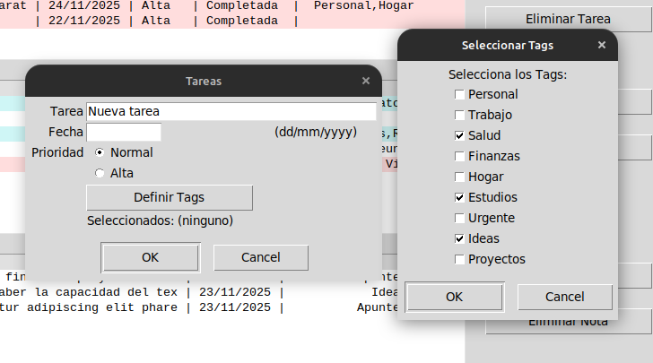

3.2 **Editar actividad ('Tareas', 'Eventos' o 'Notas')**:
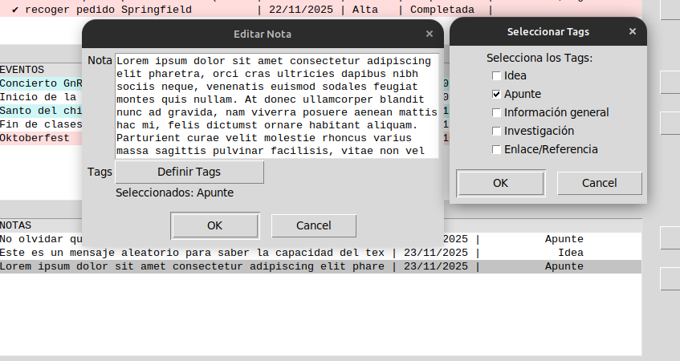

3.3 **Eliminar actividad ('Tareas', 'Eventos' o 'Notas')**:
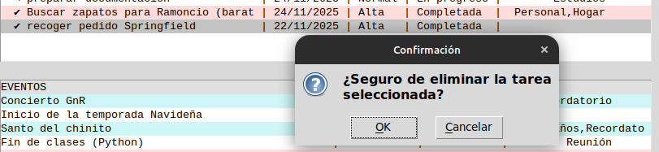

3.4 **Cambiar estado de la actividad 'Tarea'**:
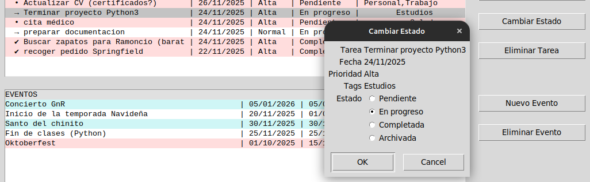

3.5 **Exportar data a JSON o generar PDF**:
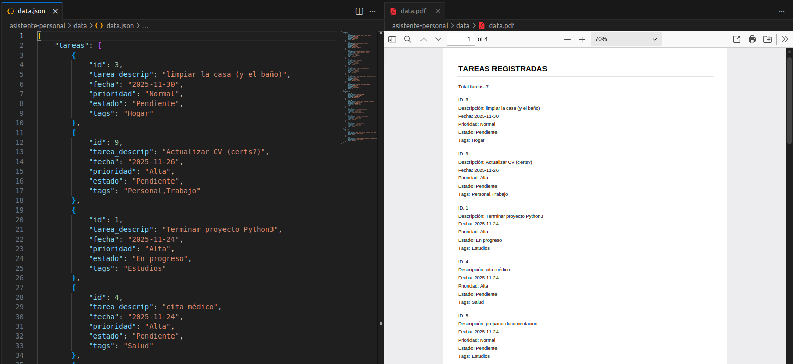

3.6 **Gráficos estadísticos (librería matplotlib)**:
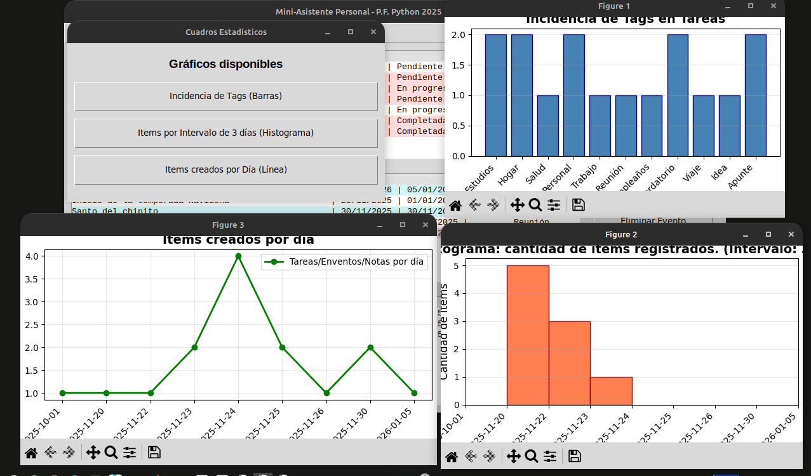

3.7 **Opciones Administrativas**:
user:" 'Administrador'
password: 'abc123' (usuario y clave original al generar la BD)

3.8 **Salir** :
* Salir del Sistema. Con la opción del menú o cerrando la ventana principal.
* La base de datos se guarda automáticamente para asegurar la persistencia de la información.

---

## 🏗️ Estructura de la Base de Datos

**Tareas**
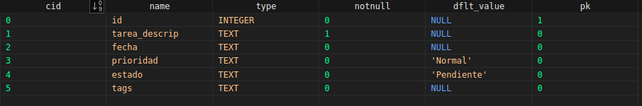
**Eventos**
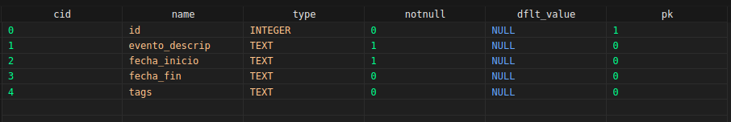
**Notas**
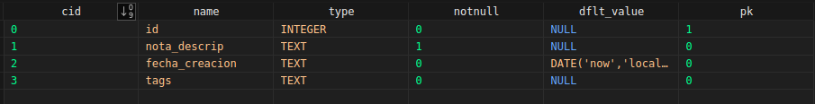
**Tags**
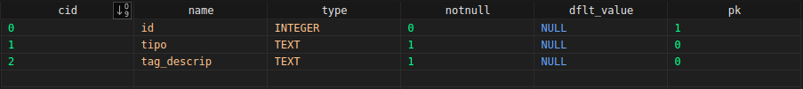
**Usuarios**
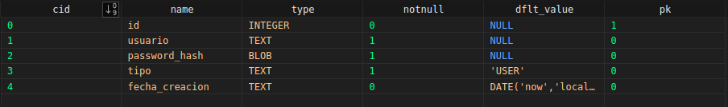

---

## 🗃️ Estrutura del proyecto

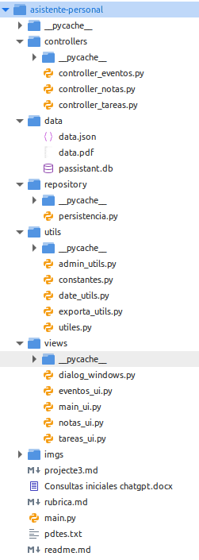

---
## 📋 Explicación del Código

Resumen por módulo y funciones clave:

- `main.py`: arranque de la aplicación. Crea la instancia de `Persistencia`, instancia `HandlerUI` y los controladores `ControllerTareas`, `ControllerEventos`, `ControllerNotas`; carga los datos y lanza `root.mainloop()`.

- `repository/persistencia.py` (clase `Persistencia`): acceso a SQLite y métodos CRUD para las entidades.
   - Métodos más importantes: `crea_tablas()`, `trae_tareas()/trae_notas()/trae_eventos()`, `trae_una_tarea()/trae_una_nota()/trae_un_evento()`,
      `guarda_nueva_tarea()/guardar_tarea()`, `guardar_nuevo_evento()/guardar_evento()`, `guardar_nueva_nota()/guardar_nota()`, `cambiar_estado_tarea()`,
      `eliminar_tarea()/eliminar_evento()/eliminar_nota()`, `todos_los_tags()`, `eliminar_data()`, `cambiar_clave()`, `obtener_tags()`, `obtener_cantidad_por_dia()`, `cerrar_conexion()`.

- `controllers/` (conectan UI ↔ BD): cada controlador expone operaciones que usa la UI.
   - `ControllerTareas`: `traer_tareas()`, `nueva_tarea()`, `cambiar_estado_tarea()`, `eliminar_tarea()`, `editar_tarea()`.
   - `ControllerEventos`: `traer_eventos()`, `nuevo_evento()`, `eliminar_evento()`, `editar_evento()`.
   - `ControllerNotas`: `traer_notas()`, `nueva_nota()`, `eliminar_nota()`, `editar_nota()`.

- `views/main_ui.py` (`HandlerUI`): interfaz principal y menú.
   - Métodos y responsabilidades clave: `set_controladores()`, `carga_tareas()/carga_eventos()/carga_notas()`, `actualiza_listbox_tareas()/actualiza_listbox_eventos()/actualiza_listbox_notas()` (formateo y colores), `doble_click_*()` (3 métodos; el nombre varía según la actividad. Sirve para 'leer' el evento doble-click en el listbox),
      `exportar_pdf_user()`, `exportar_json_user()`, `generar_graficos_user()`, `borrar_info_bd_adm()`, `cambiar_clave_adm()`, `on_closing()`.

- `views/dialog_windows.py` y diálogos:
   - `VentanaEstados`: diálogo para cambiar estado de una tarea.
   - `VentanaTags`: selector de tags (checkboxes) y devuelve una cadena separada por comas.
   - `CuadrosEstadisticos`: ventana que muestra gráficos (matplotlib) con métodos `mostrar_grafico_tags()`, `mostrar_grafico_intervalo()`, `mostrar_grafico_por_dia()`.

- `views/tareas_ui.py`, `views/eventos_ui.py`, `views/notas_ui.py`:
   - Clases `VentanaTarea`, `VentanaEvento`, `VentanaNota` — formularios de entrada con validación (`validate()`), y `mostrar_tags()` para escoger etiquetas desde la BD.

- `utils/`:
   - `utiles.py`: re-exporta utilidades (fecha, diálogos, exportes, admin) para uso centralizado.
   - `date_utils.py`: `valida_fecha()`, `fecha_a_bd()`, `bd_a_fecha()`, `obtener_fecha_actual()` — conversiones y validaciones de fecha.
   - `exporta_utils.py`: `generar_json()` y `generar_pdf()` — generan informes/exportes a partir de `Persistencia`.
   - `admin_utils.py`: `borrar_info()` y `actualizar_clave_adm()` — flujos de confirmación y diálogo para operaciones administrativas.
   - `constantes.py`: constantes y mensajes globales (formatos de fecha, estados, settings PDF, textos de diálogo).


---

## ⌛ Sugerencias de mejoras para la app (Propuestas)

* Añadir **mantenimiento de tags (etiquetas)** vía menú "Administrador".
* Generar mayor cantidad del gráficos estadisticos; además es necesario más data de prueba.
* Incluir otros campos que podrían ser importantes (hora, imágenes).
* Mejorar el PDF con  **graficos**.
* Exportar a **Excel (xlsx)**.
* Buscar integración con la I.A. para facilitar aún más el uso de la app.
* Usar archivo .env para variables de entorno, tales como la clave de administrador o el nombre de la BD a generar/usar.

---
## 🧠 Uso I.A.

* La IA me ha servido como fuente de consulta para aclarar instrucciones, parámetros y resolver dudas técnicas. También me ha ayudado a diseñar interfaces en Tkinter, ofreciendo ejemplos útiles que agilizaron mi trabajo.
Lo usé como apoyo para conocimiento, y como verificador de sintaxis cuando surgió algún error indetectable.

www.chatgpt.com
www.copilot.com
---

## 📄 Licencia

Última revisión: Noviembre 2025

Desarrollo y maquetación por Franco Calderón Sánchez.

Esta obra está bajo una [licencia de Creative Commons Reconocimiento-NoComercial-CompartirIgual 4.0 Internacional](http://creativecommons.org/licenses/by-nc-sa/4.0/).
